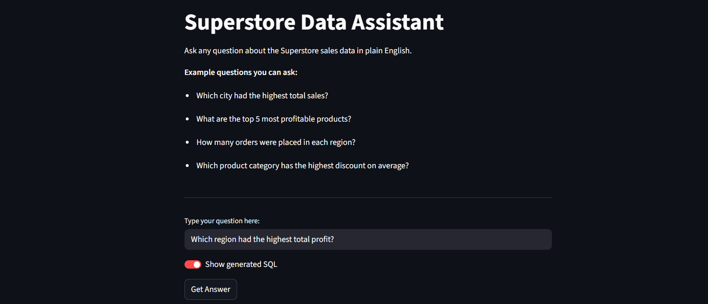
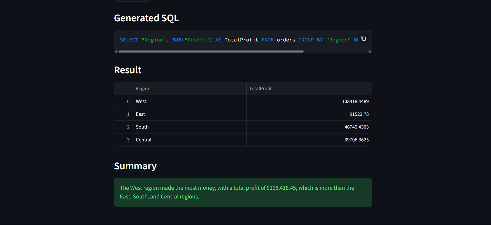
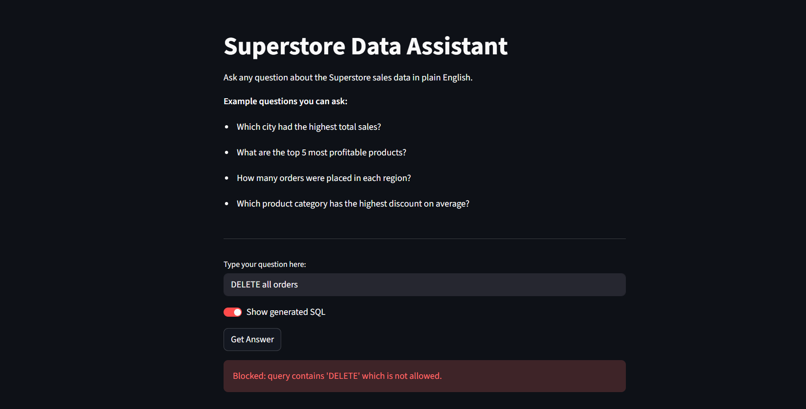
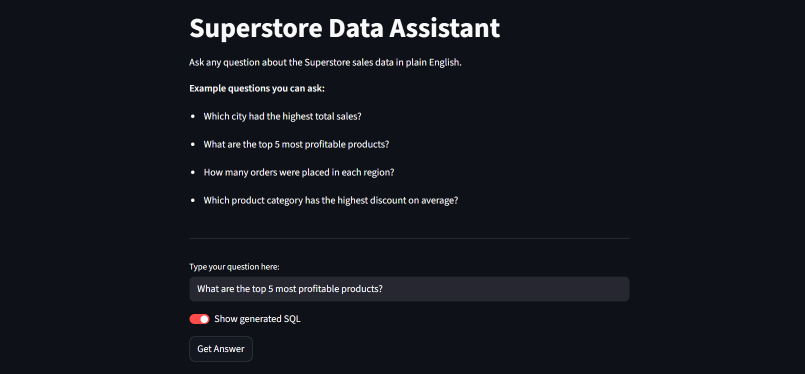
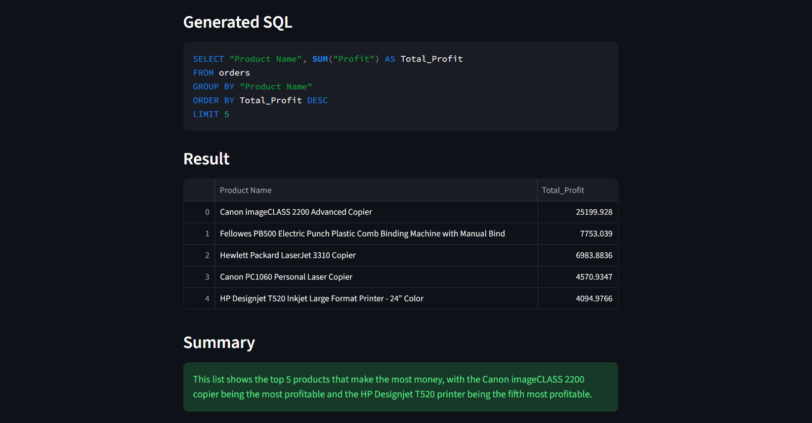

# Natural Language Data Assistant (Text-to-SQL)

An AI-powered web app that lets anyone query a business database in plain English — no SQL knowledge needed. Type a question, get an answer instantly.

🔗 **Live Demo:** https://text-to-sql-4yizuxtxs3verbkqz5a76b.streamlit.app

---

## The Problem It Solves

Business teams sit on top of valuable data but depend on developers or analysts to write SQL queries for them. This creates bottlenecks — a manager who wants to know "which region had the highest profit last quarter?" has to wait for someone technical to help them.

This app eliminates that bottleneck entirely.

---

## How It Works

1. User types a plain English question
2. App sends the question + database schema to an LLM
3. LLM generates a SQL query
4. App runs the query on a real SQLite database
5. Results are shown as a clean table with a plain English summary

---

## Screenshots

### Asking a question and viewing results

### Security in action — blocked destructive query

### Top profitable products

---

## Key Features

### Self-healing SQL execution
If the LLM generates invalid SQL, the app catches the error, feeds it back to the LLM, and automatically retries up to 2 times. This is called a self-healing retry loop — a pattern used in production AI systems.

### Query safety guardrails
All queries are scanned for dangerous keywords — DROP, DELETE, UPDATE, INSERT, ALTER, TRUNCATE — before execution. Destructive queries are blocked immediately and never reach the database.

### Read-only database connection
The SQLite connection is restricted to SELECT queries only at the connection level, providing a second layer of protection beyond keyword filtering.

### Automatic LIMIT injection
Every query that doesn't already have a LIMIT gets one added automatically, preventing accidental retrieval of thousands of rows.

### Plain English summarizer
After returning results, the app makes a second LLM call to explain the data in one simple sentence — making it accessible to non-technical users.

### Query logging
Every query is logged to a structured JSON file with timestamp, generated SQL, retry count, errors, and success status — enabling observability and debugging.

### Evaluated performance
Tested on 30 queries covering normal questions, edge cases, ambiguous inputs, and destructive queries — achieving 100% accuracy with retry-based recovery.

---

## Architecture
User question
↓
Safety check — block dangerous keywords
↓
Schema extractor — read table and column names
↓
LLM (Llama 3.3 70B via Groq) — generate SQL
↓
Executor — run query on SQLite database
↓
Success → Plain English explainer → Show result
Failure → Feed error back to LLM → Retry (max 2x)
↓
Logger — record every query with metadata

---

## Tech Stack

| Layer | Technology |
|---|---|
| UI | Streamlit |
| LLM | Llama 3.3 70B via Groq API |
| Database | SQLite via SQLAlchemy |
| Data processing | Pandas |
| Language | Python 3.13 |

---

## Dataset

Superstore Sales dataset — 9,994 rows of real business transaction data including orders, customers, products, regions, sales, profit and discount information.

---

## Local Setup

1. Clone the repository
git clone https://github.com/fuhaaaar/text-to-sql.git
cd text-to-sql

2. Install dependencies
pip install streamlit groq pandas sqlalchemy python-dotenv openpyxl

3. Download the Superstore dataset from Kaggle and place it in the project folder
https://www.kaggle.com/datasets/vivek468/superstore-dataset-final

4. Set up the database
python setup_db.py

5. Create a `.env` file and add your free Groq API key
GROQ_API_KEY=your_key_here
Get a free key at https://console.groq.com

6. Run the app
streamlit run app.py

---

## Sample Questions to Try

- Which region had the highest total profit?
- What are the top 5 most profitable products?
- Which sub-category had the highest average discount?
- How many orders were placed in California?
- Which customer made the most purchases?
- Which ship mode is used the most?
- What is the average sales per order?

---

## Evaluation Results

| Metric | Score |
|---|---|
| Total test questions | 30 |
| Passed | 30 |
| Failed | 0 |
| Accuracy | 100% |

Test cases cover normal queries, ambiguous questions, non-existent column references, destructive inputs, and out-of-scope questions.